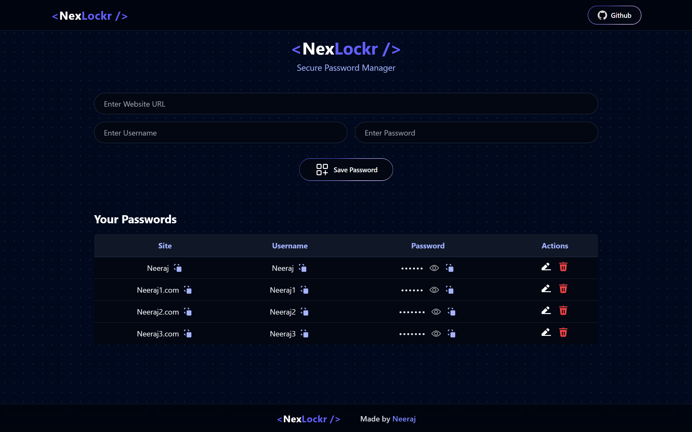

# <NexLockr /> - Secure Password Manager



[](https://nexlockr.netlify.app)

**NexLockr** is a secure, custom-designed, and highly responsive Password Manager application built using the MERN stack (MongoDB, Express, React, Node.js). It allows users to safely store, view, edit, and manage their web credentials in a sleek, dark-mode interface.

## 🚀 Features
- **Add Passwords:** Save website URLs, usernames, and passwords securely.
- **Custom Visibility Toggle:** Engineered a state-driven "Show/Hide" eye toggle to instantly mask or unmask saved credentials on demand.
- **Copy to Clipboard:** One-click copy functionality for quickly grabbing websites, usernames, and passwords.
- **Edit & Delete:** Easily update existing credentials or remove them from the database.
- **Premium Dark-Mode UI:** Fully overhauled frontend using **Tailwind CSS** for a modern, high-contrast, and custom user experience.
- **Backend API:** Custom Node.js/Express server connecting to MongoDB for persistent data storage.

## 🛠️ Tech Stack
- **Frontend:** React (Vite), Tailwind CSS, React Toastify, Lottie/LordIcon
- **Backend:** Node.js, Express.js, Body-Parser, CORS
- **Database:** MongoDB (Atlas/Local)
- **Deployment:** Netlify (Frontend)

---

## ⚙️ Installation & Setup (Run Locally)

If you want to run this project locally on your machine, follow these steps. You need to run both the **Frontend** and **Backend** terminals.

### 1. Prerequisites
- [Node.js](https://nodejs.org/) installed.
- [MongoDB Compass](https://www.mongodb.com/products/tools/compass) installed and running locally on `mongodb://localhost:27017` (or use a MongoDB Atlas URI).

### 2. Setup Backend (Server)
Open a terminal and navigate to the backend folder:
```bash
cd backend
npm install
```

Create a `.env` file in the `backend` folder and add your database connection string:

```env
MONGO_URI=mongodb://localhost:27017
# OR your MongoDB Atlas Connection String
```

Start the server:

```bash
node server.js
```

*The server will run on `http://localhost:3000`*

### 3. Setup Frontend (Client)

Open a **new** terminal (split terminal) in the project root:

```bash
npm install
npm run dev
```

*The application will run on `http://localhost:5173`*

---

## 📂 Project Structure

```text
NexLockr/
├── backend/            # Express Server & MongoDB Logic
│   ├── server.js       # API Routes (GET, POST, DELETE)
│   └── package.json    # Backend dependencies
├── public/             # Static Assets
│   └── NexLockr.png    # Project Screenshot
├── src/                # React Frontend
│   ├── components/     # Navbar, Manager, Footer
│   ├── App.jsx         # Main Component
│   └── main.jsx        # Entry point
└── index.html          # HTML Root
```

## 🤝 Contributing

Feel free to fork this repository and submit pull requests to improve the UI or add features (like full user authentication!).

---

*Created by [Neeraj Saini](https://github.com/NeerajSaini271)*